[](https://www.nxp.com)

## Industrial Connectivity FRDM-MCXN947 panel

Industrial connectivity panel is a improved version, with new features, improved graphics and performance. Demo has LCD for graphics, motor control, temperature sensors, accelerometer (Mikroe Accel4Click), core performance and RTC.

#### Boards: FRDM-MCXN947
#### Categories: HMI, Industrial, Graphics, Motor Control, Communication
#### Peripherals: GPIO, I2C, USB, CAN, Ethernet, FLEXIO, ENC, PWM 
#### Toolchains: VS Code

## Table of Contents
1. [Software](#step1)
2. [Hardware](#step2)
3. [Setup](#step3)
4. [Results](#step4)
4. [Release Notes](#step5)

## 1. Software<a name="step1"></a>
- [VSCode (1.107.0)](https://code.visualstudio.com/)
- [MCUXpresso for VSCode extension (25.11.16)](https://marketplace.visualstudio.com/items?itemName=NXPSemiconductors.mcuxpresso)
- [SDK version 25.12.0](https://github.com/nxp-mcuxpresso/mcuxsdk-core)

## 2. Hardware (Each Panel)<a name="step2"></a>
- [FRDM-MCXN947](https://www.nxp.com/design/design-center/development-boards-and-designs/FRDM-MCXN947)
[<p align="center"></p>](Media/MCXN947.png)
- [LCD-PAR-S035](https://www.nxp.com/design/design-center/development-boards-and-designs/LCD-PAR-S035)
[<p align="center">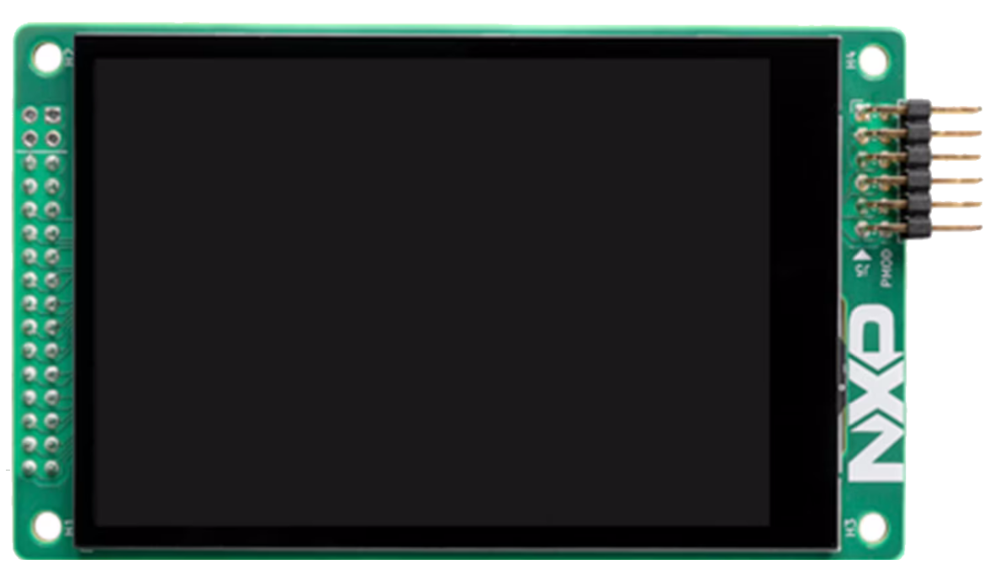</p>](Media/LCD-PAR-S035.png)
- [FRDM-MC-LVPMSM (Only Main Panel)](https://www.nxp.com/design/design-center/development-boards-and-designs/general-purpose-mcus/nxp-freedom-development-platform-for-low-voltage-3-phase-pmsm-motor-control:FRDM-MC-LVPMSM)
[<p align="center">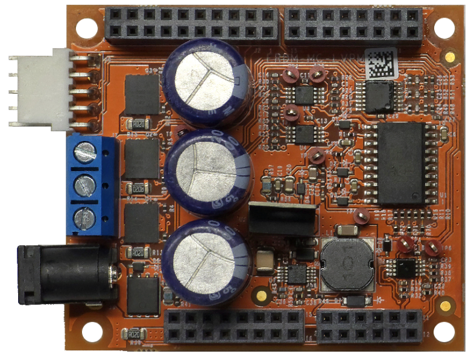</p>](Media/FRDM-MC-LVPMSM.png)
- [FRDM-MC-LVMTR](https://www.nxp.com/design/design-center/development-boards-and-designs/FRDM-MC-LVMTR)
[<p align="center">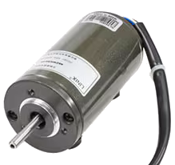</p>](Media/FRDM-MC-LVMTR.png)
- [Mikroe Accel4Click](https://www.mikroe.com/accel-4-click)
[<p align="center">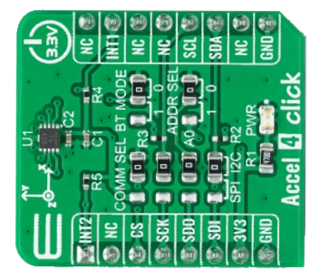</p>](Media/Accel4Click.png)
- USB Type-C cables
- Ethernet cable
- Power supply 24v 5Amp for Motor Control Shield

## 3. Setup<a name="step3"></a>

### 3.1 Prepare FRDM-MC-LVPMSM
1. Fold pin of shield
[<p align="center">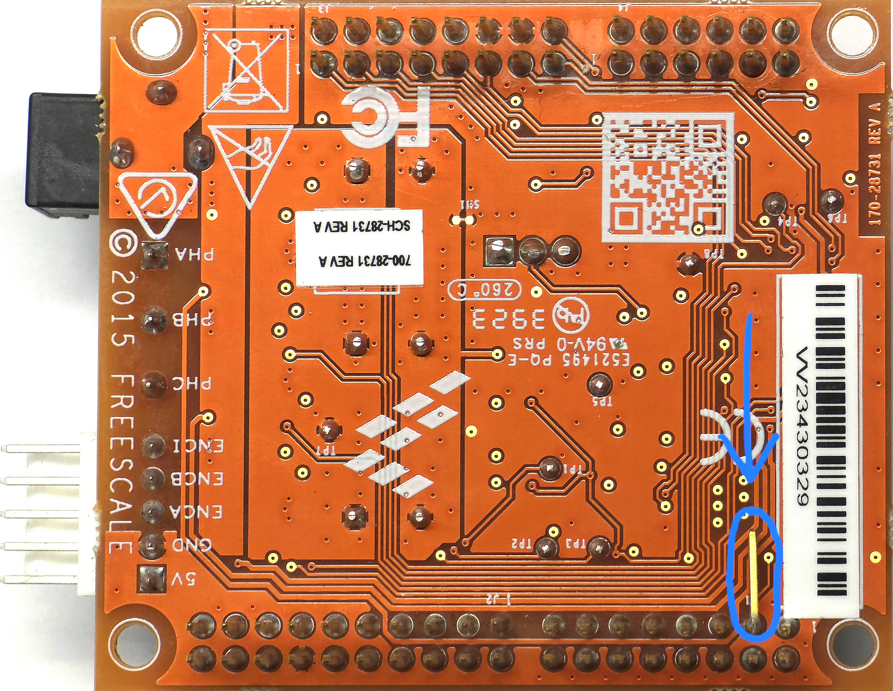</p>](Media/FOLD_PIN.jpg)

### 3.2 Plug into FRDM-MCXN947
Plug components as image bellow
[<p align="center">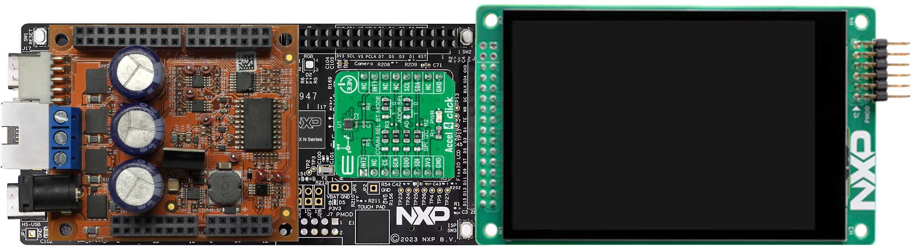</p>](Media/IndustrialPanelV2_MCXN947_Plug.png)

### 3.3 Prepare before import code
1. [Install VSCode.](https://www.nxp.com/design/design-center/training/TIP-GETTING-STARTED-WITH-MCUXPRESSO-FOR-VS-CODE)
2. [Install MCUXpresso for VSCode extension.](https://www.nxp.com/design/design-center/training/TIP-GETTING-STARTED-WITH-MCUXPRESSO-FOR-VS-CODE)
3. [Import SDK repository (Import could be take about an hour).](https://www.nxp.com/design/design-center/training/TIP-GETTING-STARTED-WITH-MCUXPRESSO-FOR-VS-CODE)
    - Open MCUXpresso for VSCode extension.
    - In Quick Start Panel window click in Import Repository.
    - Select MCUXpresso SDK repository.
    - Select main revision or specific if is needed.
    - Select save location.
    - Click import.
    - Import could be take about an hour.

### 3.4 Import example from Application Code Hub
1. Open MCUXpresso for VSCode extension.
2. In Quick Start Panel window click in Application Code Hub.
3. In Search text field, type the name of desired example.
4. Select example, put some name for save the example, and the directory where the example will be saved.
5. Click in Import Project and wait few seconds.

### 3.5 Setup code
1. Configure Master, Interface mode, Automatic or Manual IP configuration and StandBy enable.
    1. On file screen/screen_app.h are three macros.

            10 #define AUTO_CONFIG_NETWORK 0
            11 #define MASTER_MODE 0
            12 #define STAND_BY_ENABLE 1
        - AUTO_CONFIG_NETWORK: Here selects ip configuration.   
        0 -> Enables manual configuration, user can select static ip or dhcp   
        1 -> Set defalut static IP (Master mode: 192.168.1.110, Interface mode: 192.168.1.111)
        - MASTER_MODE: Selects between Master or Interface mode.
        - STAND_BY_ENABLE: Enables stand by screen.
2. Compile Project.

### 3.6 Flash the FRDM-MCXN947 Application
1. Connect FRDM-MCXN947 to computer with USB-C cable in J17.
2. Open MCUXpresso extension in VSCode.
3. Select the project "dm-ip-frdmmcxn947-eth-panel".
4. Expand project and expand "Project Files" option
5. Open CMakePresets.json
6. Open Windows File Explorer and go to path, see your version of ".venv_3_13"
```
C:/Users/%YourUserName%/.mcuxpressotools/
```
7. Replace version in CMakePresets.json in section of "configurePresets" -> "cacheVariables" -> "Python3_EXECUTABLE"
```
        "Python3_EXECUTABLE": {
          "type": "FILEPATH",
          "value": "$env{ARMGCC_DIR}/../.venv_3_13/Scripts/python.exe"
        }
```
8. Do right click on project and select pristine build and wait about a one minute.
9. Click run (play icon).
10. Please wait a few seconds.
11. Now click stop in center upper button.
12. Disconnect USB-C cable of the board

### 3.7 Connect Motor Control Shield
1. Connect wires of motor
2. Connect Power Supply 24vDC, 5Amp

### 3.8 Start demo
1. Connect again USB-C cable.

### 3.10 Connect panels
- Connect main panel to interface panel with ethernet cable, or connect both into a modem or swithch (Optional)

## 4. Results<a name="step4"></a>

### 4.1 Description of demo

FRDM Industrial Connectivity Demo use several boards of FRDM family. FRDM-MCXN947 actuates in two modes, master and interface. [FRDM-MCXC444](https://github.com/nxp-appcodehub/dm-ip-frdmmcxc444-rotary-motor-update-usb), [FRDM-MCXC242](https://github.com/nxp-appcodehub/dm-ip-frdmmcxc242-rotary-motor-update-usb) and [FRDM-MCXA153](https://github.com/nxp-appcodehub/dm-ip-frdmmcxa153-oled-motor-graph-usb) can be peripherals of FRDM-MCXN947 panels, example code are available on Application Code Hub.    

FRDM-MCXN947 in master mode is the main panel, here is motor and all measures (Accelerometer, BRD Temperature, MCU Temperature, CPU performance, RTC and RPM). This mode have three comunications protocols, there are Ethernet, USB and CAN. Ethernet has all capabilities, this use sockets to communicate with six clients in different ports, in this protocol are sended all measures and is possible to set time and rpm configurations. USB and CAN protocol can get RPM measrues and set RPM configuration.

FRDM-MCXN947 in interface mode has same graphic interface as master mode, but this panel gets all values through ethernet communication wiht main panel. Also support USB and CAN pheriperals.

### 4.2 Screens of demo
1. Main Screen
[<p align="center">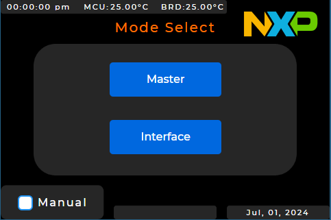</p>](Media/Screen/1InitScreen.PNG)
Main Screen gives options to select panel mode, master or interface. For change ip configurations is necessary click on "Manual" check button. 

2. StandBy Screen
[<p align="center">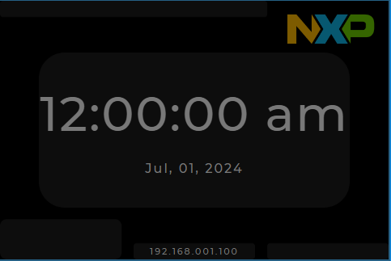</p>](Media/Screen/11StandByScreen.PNG)
This screen appear when click doesn't detected in many seconds.

3. Config IP Screen
[<p align="center">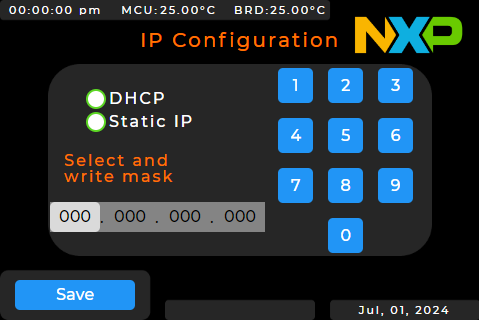</p>](Media/Screen/2IPConfigScreen.PNG)
Here can be configurated IP of panel, is posible select a static ip or use dhcp (if modem supports dhcp).

4. Config Server IP Screen (Only in interface mode)
[<p align="center">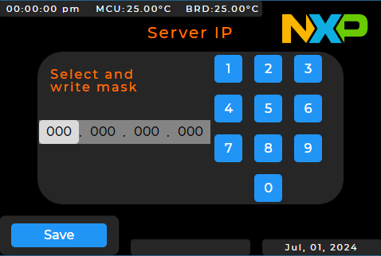</p>](Media/Screen/3ServerIPConfigScreen.PNG)
Only in interface mode, this screen is to set ip of master panel. IP of panel are available in bottom of screen.

5. Menu Screen
[<p align="center">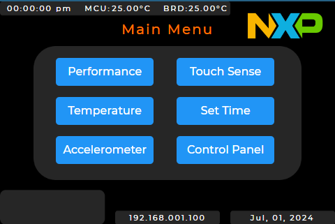</p>](Media/Screen/4MenuScreen.PNG)
Menu Screen shows all available options to measure and set configurations. Click on any option to change screen.
6. Performance Screen
[<p align="center">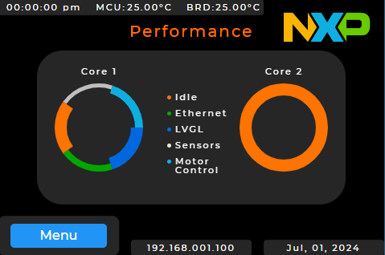</p>](Media/Screen/5PerformanceScreen.PNG)
This screen shows tasks occupation in cores.

7. Temperature Screen
[<p align="center">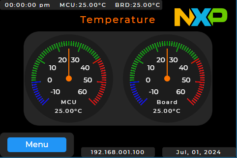</p>](Media/Screen/6TemperatureScreen.PNG)
Temperature Screen shows MCU temperature and BRD temperature.

8. Accelerometer Screen
[<p align="center">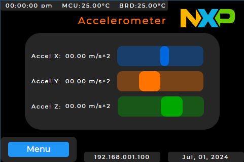</p>](Media/Screen/7AccelerometerScreen.PNG)
Here are available three axis information of Accelerometer.

9. Touch Sence Screen
[<p align="center">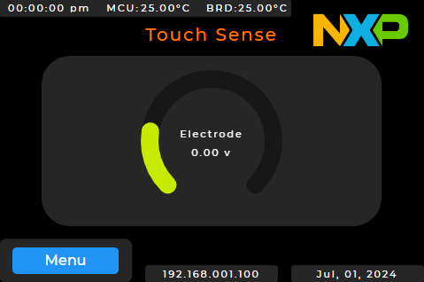</p>](Media/Screen/8TouchScreen.PNG)
This screen only has an arc and lables, but is not implemented any sensor.

10. Set Time Screen
[<p align="center">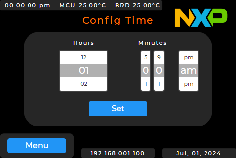</p>](Media/Screen/10SetTimeScreen.PNG)
In set time screen is possible to configure time of main panel.

11. Control Panel Screen
[<p align="center">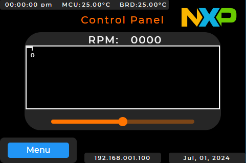</p>](Media/Screen/9ControlPanelScreen.PNG)
Here shows real time RPM of motor and can be configurated desired RPM of motor.

#### Project Metadata

<!----- Boards ----->
[]()

<!----- Categories ----->
[](https://mcuxpresso.nxp.com/appcodehub?category=hmi)
[](https://mcuxpresso.nxp.com/appcodehub?category=industrial)
[](https://mcuxpresso.nxp.com/appcodehub?category=ui)
[](https://mcuxpresso.nxp.com/appcodehub?category=graphics)
[](https://mcuxpresso.nxp.com/appcodehub?category=motor_control)

<!----- Peripherals ----->
[](https://mcuxpresso.nxp.com/appcodehub?peripheral=gpio)
[](https://mcuxpresso.nxp.com/appcodehub?peripheral=i2c)
[](https://mcuxpresso.nxp.com/appcodehub?peripheral=usb)
[](https://mcuxpresso.nxp.com/appcodehub?peripheral=adc)
[](https://mcuxpresso.nxp.com/appcodehub?peripheral=can)
[](https://mcuxpresso.nxp.com/appcodehub?peripheral=flexio)
[](https://mcuxpresso.nxp.com/appcodehub?peripheral=clocks)
[](https://mcuxpresso.nxp.com/appcodehub?peripheral=i3c)
[](https://mcuxpresso.nxp.com/appcodehub?peripheral=pwm)
[](https://mcuxpresso.nxp.com/appcodehub?peripheral=uart)
[](https://mcuxpresso.nxp.com/appcodehub?peripheral=smartdma)
[](https://mcuxpresso.nxp.com/appcodehub?peripheral=ethernet)

<!----- Toolchains ----->
[](https://mcuxpresso.nxp.com/appcodehub?toolchain=mcux)
[](https://mcuxpresso.nxp.com/appcodehub?toolchain=vscode)

Questions regarding the content/correctness of this example can be entered as Issues within this GitHub repository.

>**Warning**: For more general technical questions regarding NXP Microcontrollers and the difference in expected functionality, enter your questions on the [NXP Community Forum](https://community.nxp.com/)

[](https://www.youtube.com/NXP_Semiconductors)
[](https://www.linkedin.com/company/nxp-semiconductors)
[](https://www.facebook.com/nxpsemi/)
[](https://x.com/NXP)

## 5. Release Notes<a name="step5"></a>
| Version | Description / Update                           | Date                           |
|:-------:|------------------------------------------------|-------------------------------:|
| 1.0     | Initial release on Application Code Hub        | February 28 <sup>th</sup> 2026 |

## Licensing

<small>
<b>Trademarks and Service Marks</b>: There are a number of proprietary logos, service marks, trademarks, slogans and product designations ("Marks") found on this Site. By making the Marks available on this Site, NXP is not granting you a license to use them in any fashion. Access to this Site does not confer upon you any license to the Marks under any of NXP or any third party's intellectual property rights. While NXP encourages others to link to our URL, no NXP trademark or service mark may be used as a hyperlink without NXP’s prior written permission. The following Marks are the property of NXP. This list is not comprehensive; the absence of a Mark from the list does not constitute a waiver of intellectual property rights established by NXP in a Mark.
</small>
<br>
<small>
NXP, the NXP logo, NXP SECURE CONNECTIONS FOR A SMARTER WORLD, Airfast, Altivec, ByLink, CodeWarrior, ColdFire, ColdFire+, CoolFlux, CoolFlux DSP, DESFire, EdgeLock, EdgeScale, EdgeVerse, elQ, Embrace, Freescale, GreenChip, HITAG, ICODE and I-CODE, Immersiv3D, I2C-bus logo , JCOP, Kinetis, Layerscape, MagniV, Mantis, MCCI, MIFARE, MIFARE Classic, MIFARE FleX, MIFARE4Mobile, MIFARE Plus, MIFARE Ultralight, MiGLO, MOBILEGT, NTAG, PEG, Plus X, POR, PowerQUICC, Processor Expert, QorIQ, QorIQ Qonverge, RoadLink wordmark and logo, SafeAssure, SafeAssure logo , SmartLX, SmartMX, StarCore, Symphony, Tower, TriMedia, Trimension, UCODE, VortiQa, Vybrid are trademarks of NXP B.V. All other product or service names are the property of their respective owners. © 2021 NXP B.V.
</small>